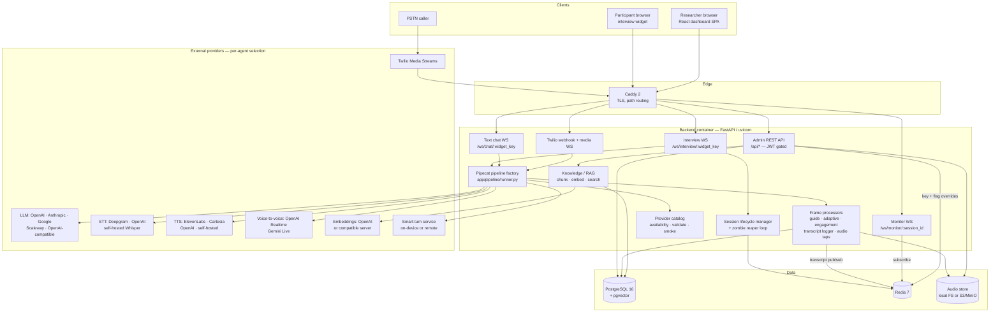
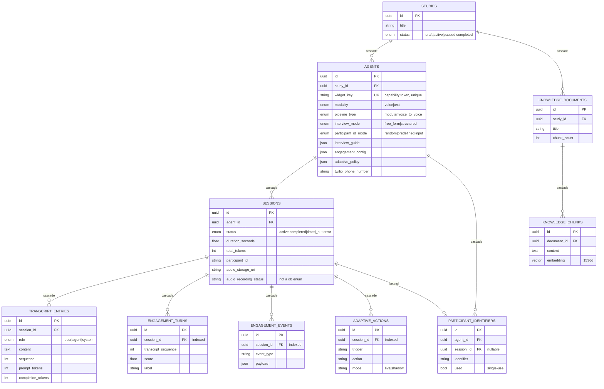

# Architecture Design: OASIS — Open Agentic Survey Interview System

> **Provenance.** This document was reverse-engineered from the codebase on **2026-09-17**. It describes the system **as implemented**, not as specified. It has not been validated against stakeholder intent and must **not** be treated as approved requirements. Every design decision below is marked `_(inferred from code)_` unless it cites an existing approved document.

> **Status:** Complete. Phase 1 = system overview, components, integrations, decisions, risks. Phase 2 (added 2026-09-17) = Data Model, Entity Relationship Diagram, API Contracts.

OASIS is a self-hosted, single-tenant modular monolith that runs AI-powered conversational research interviews over voice, telephone, and text. A React dashboard lets a researcher define a study, configure an interview agent, and share a participant link; a FastAPI backend resolves that link to an agent, boots a [Pipecat](https://github.com/pipecat-ai/pipecat) media pipeline per participant, and persists a diarized transcript plus optional engagement metrics and audio. All AI capability is delegated to pluggable external or self-hosted providers selected per agent; no model runs inside the platform itself _(inferred from code)_.

## Related Documents

This architecture deliberately does **not** restate material already documented. Treat these as authoritative for their subject:

| Document | Owns |
|---|---|
| [`DEPLOYMENT.md`](DEPLOYMENT.md) | Deployment runbook, host requirements, TLS, upgrade procedure |
| [`ADAPTIVE_BEHAVIOR.md`](ADAPTIVE_BEHAVIOR.md) | Adaptive policy rules, triggers, actions, shadow mode semantics |
| [`ENGAGEMENT_METRICS.md`](ENGAGEMENT_METRICS.md) | Engagement feature extraction and scoring methodology |
| [`AUDIO_RECORDING.md`](AUDIO_RECORDING.md) | Audio capture, file layout, manifest format, retrieval |

## System Architecture

The deployment is a single Docker Compose stack of five containers on one bridge network (`docker-compose.yml`). Caddy terminates TLS and is the only component with published ports; everything else is reachable only inside `oasis_net` _(inferred from code)_.

Routing at the edge is path-based (`docker/Caddyfile`):

- `/api/*` → `backend:8000`
- `/ws/*` → `backend:8000` (with a 30 s keepalive transport for long-lived audio streams)
- everything else → `frontend:80` (static SPA bundle served by nginx)

The backend is a **modular monolith**: the REST admin API, all three WebSocket planes, the Twilio telephony plane, and the media pipelines themselves all run inside the same uvicorn process as asyncio tasks _(inferred from `backend/app/main.py`)_. There is no worker tier, queue, or separate media server.

### Component Diagram

## Key Components

### Admin REST API (`backend/app/api/router.py`)
Eight routers mounted under `/api`, all gated by the `require_auth` dependency: `studies`, `agents`, `sessions`, `analytics`, `participants`, `knowledge`, `settings`, `templates`. The `auth` router is deliberately public. Two further endpoints sit directly on the app and are public by design: `/api/widget/{widget_key}` (widget bootstrap config) and `/api/health` (API + Postgres + Redis liveness) _(inferred from `main.py:82,147`)_.

### Realtime planes
Three WebSocket endpoints are registered **outside** the `/api` prefix and therefore outside the `require_auth` dependency chain _(inferred from `main.py:72-78`)_:

| Endpoint | Client | Protocol | Authentication |
|---|---|---|---|
| `/ws/interview/{widget_key}` | Participant widget | Raw PCM over Pipecat protobuf frames | None — `widget_key` is the capability |
| `/ws/chat/{widget_key}` | Participant widget (text mode) | JSON messages | None — `widget_key` is the capability |
| `/ws/monitor/{session_id}` | Researcher dashboard | JSON transcript events | JWT in `?token=` query param, rejected with WS close `4401` when `AUTH_ENABLED` _(`api/monitor.py:47-56`)_ |

The monitor plane backfills the stored transcript on connect, then streams live entries from a Redis pub/sub channel (`oasis:transcript:{session_id}`) and finally a `session_ended` event _(inferred from `realtime.py`, `api/monitor.py`)_.

### Pipeline factory (`backend/app/pipeline/runner.py`)
Builds one of two Pipecat 1.x pipeline shapes per session, chosen by the agent's `pipeline_type`:

- **Modular:** `Transport(in) → STT → UserCapture → UserCtx → LLM → TranscriptLogger → TTS → Transport(out)`
- **Voice-to-voice:** `Transport(in) → Realtime/Live LLM → UserCapture → TranscriptLogger → Transport(out)` (OpenAI Realtime or Gemini Live)

Under Pipecat 1.x, VAD and turn detection are configured on `LLMUserAggregatorParams` rather than the transport, and silence handling uses the aggregator's `on_user_turn_idle` event _(documented in the module header; inferred as a deliberate migration decision)_.

### Frame processors (`backend/app/pipeline/`)
Composable Pipecat `FrameProcessor` units inserted into the pipeline according to agent configuration:

- `interview_guide.py` — structured-interview support. Implemented as **prompt engineering plus a turn counter**, not a state machine: `build_structured_prompt()` renders the researcher's guide into the system prompt, and `InterviewGuideProcessor` injects an advance-nudge message after `max_follow_ups` exchanges on one question _(inferred from module header)_.
- `engagement_processor.py` / `adaptive_processor.py` — per-turn scoring and the opt-in adaptive policy. See [`ENGAGEMENT_METRICS.md`](ENGAGEMENT_METRICS.md) and [`ADAPTIVE_BEHAVIOR.md`](ADAPTIVE_BEHAVIOR.md).
- `transcript_logger.py` — persists `TranscriptEntry` rows and publishes each to Redis for live monitors.
- `app/audio/recording.py` — `UserAudioTap` / `AgentAudioTap` feed an `AudioRecordingManager`. See [`AUDIO_RECORDING.md`](AUDIO_RECORDING.md).

### Provider subsystem (`backend/app/providers/`)
Four cooperating modules _(inferred from code)_:

- `catalog.py` — the single source of truth for selectable models, providers, and voices. Frozen dataclasses (`ModelOption`, `ProviderOption`, `VoiceOption`) carry a provider, an `ApiKind` (`chat_completions`, `responses`, `realtime`, `gemini_live`, `transcription_http`, `transcription_realtime`, `tts_http`) and the `PipelineKind`s each entry is valid for. **Specific model IDs are intentionally not reproduced in this document — read `backend/app/providers/catalog.py` for the current list.**
- `availability.py` — maps each provider to its required credential fields and answers "is this provider configured?", honouring dashboard overrides.
- `validate.py` — `validate_agent_pipeline_config()` runs a compatibility gate **before** a pipeline boots, so a misconfigured agent fails at connect time rather than mid-interview _(`api/interviews.py:77`)_.
- `smoke.py` — on-demand live verification of configured providers, surfaced at `POST /api/settings/smoke-test`.

### Session lifecycle (`backend/app/session_manager.py`)
Active sessions are registered in Redis under `oasis:session:{id}` with a TTL of the agent's `max_duration_seconds` plus a 120 s buffer, and tracked in an `oasis:active_sessions` set. A background `session_cleanup_loop` started at app lifespan runs every 60 s, detects entries whose key expired but which remain in the set, and marks the corresponding Postgres row `timed_out` with a computed duration. Redis TTL is the backstop for a crashed pipeline; a hard `_MAX_PIPELINE_SECONDS = 7200` ceiling applies in the WebSocket handlers _(inferred from code)_.

### Knowledge base / RAG (`backend/app/knowledge/embeddings.py`)
Documents uploaded per study are chunked (800 chars, 200 overlap, preferring paragraph then sentence boundaries), embedded via OpenAI or any OpenAI-compatible embedding server, and stored as `KnowledgeChunk` rows. Retrieval is pgvector cosine-distance search _(inferred from code)_.

### Frontend SPA (`frontend/src/`)
React 18 + Vite + TypeScript + Tailwind. `AuthContext` provides a `RequireAuth` guard; the participant route `/interview/:widgetKey` is deliberately outside the guard, while all dashboard routes sit behind it _(inferred from `App.tsx`)_. The widget speaks the Pipecat protobuf frame protocol directly via `lib/pipecat-proto.ts` and captures/plays audio via `lib/audio.ts`. Full route and module map: `technical-design.md` § Folder Structure.

## Integration Points

| Integration | Direction | Transport | Configuration |
|---|---|---|---|
| OpenAI (chat, responses, Realtime, STT, TTS, embeddings) | Outbound | HTTPS / WSS | `OPENAI_API_KEY`; `OPENAI_USE_EU=true` reroutes **all** OpenAI traffic to `eu.api.openai.com` for data residency _(`pipeline/runner.py:59-87`)_ |
| Anthropic, Google GenAI / Gemini Live, Scaleway | Outbound | HTTPS / WSS | Per-provider key; Scaleway is OpenAI-compatible via a Bearer secret key |
| Azure OpenAI, GCP Vertex | Outbound | HTTPS | Config fields exist but both are listed in `_DISABLED_PROVIDERS` and currently report as unavailable _(`providers/availability.py:26`)_ |
| Any OpenAI-compatible LLM / STT / TTS / embedding server | Outbound | HTTPS | `OPENAI_COMPATIBLE_LLM_URL`, `SELF_HOSTED_STT_URL`, `SELF_HOSTED_TTS_URL`, `EMBEDDING_API_URL` — the self-hosting escape hatch |
| Deepgram, ElevenLabs, Cartesia | Outbound | HTTPS / WSS | Per-provider key |
| Smart-turn detection | Outbound (optional) | HTTP | Bundled on-device model by default; `SMART_TURN_REMOTE_URL` routes to a self-hosted service |
| Twilio | **Inbound** webhook + bidirectional media | HTTPS POST → TwiML, then WSS μ-law 8 kHz | `POST /api/twilio/voice/{agent_id}` returns TwiML connecting the call to `WS /ws/twilio/{agent_id}` |
| S3 / MinIO | Outbound (optional) | HTTPS | `AUDIO_STORAGE_BACKEND=s3`; custom endpoint supported for MinIO |
| Browser participant widget | **Inbound** | WSS, Pipecat protobuf | `widget_key` capability URL |

## Architecture Approach and Design Decisions

All decisions below are `_(inferred from code)_` — reconstructed from implementation, not from a recorded decision log.

| # | Decision | As implemented | Trade-off observed in code |
|---|---|---|---|
| D1 | Modular monolith, pipelines in-process | One backend container runs API, WS planes and all media pipelines as asyncio tasks | Simple to self-host; no independent scaling of media work, and Redis pub/sub fan-out assumes a single replica |
| D2 | Two pipeline shapes per agent | `pipeline_type` = `modular` \| `voice_to_voice` | V2V lowers latency but loses transcript fidelity — `main.py:128-135` force-disables the participant progress bar for V2V because the hidden progress marker cannot be stripped |
| D3 | Structured interviews via prompt, not FSM | `build_structured_prompt()` + turn-counter nudge | Far less code and adapts to natural conversation; adherence depends on model instruction-following. Alternative considered by implication: a stateful question FSM |
| D4 | Provider abstraction as a curated in-code catalog | Frozen dataclasses + availability gate + pre-flight validation | Guarantees UI and runtime agree; requires a code change when vendors add or retire models (see R8) |
| D5 | Runtime credential overrides in Redis | Dashboard writes to `oasis:settings:api_keys` / `:flags`, which take precedence over `.env` | Operators reconfigure without restarting containers; provider secrets now live in Redis as well as env (see R7) |
| D6 | Capability-URL participant access | Unguessable `widget_key` on the Agent row is the only participant credential | Frictionless participation, no participant accounts; link possession equals interview access |
| D7 | Single shared operator identity | One `AUTH_USERNAME` / `AUTH_PASSWORD`, stateless HS256 JWT, 24 h expiry | Trivial to deploy; no per-user attribution, roles, or revocation (see R3, R5) |
| D8 | Postgres for durable state, Redis for ephemeral | UUID PKs, `ON DELETE CASCADE` throughout; Redis holds TTL session keys, pub/sub, settings overrides | Clean crash semantics via TTL; Redis becomes a correctness dependency at startup (`main.py:33-34` pings Redis and will fail startup if unreachable) |
| D9 | Data residency as a first-class flag | `OPENAI_USE_EU` reroutes every OpenAI call, including Realtime WSS | Supports EU research governance; only implemented for OpenAI, not other vendors |
| D10 | Self-hosting escape hatch everywhere | Every AI role accepts an OpenAI-compatible base URL | Fulfils the "your infrastructure, your data" product claim; widens the config surface considerably |

## Standards Compliance

**No standards were supplied with this engagement.** This section is intentionally empty rather than omitted: if the platform is required to evidence compliance with an institutional data-protection, research-ethics, or accessibility standard, that mapping has not been produced and should be commissioned separately. Data-residency support (`OPENAI_USE_EU`) and full self-hosting are the only compliance-shaped capabilities currently present in code.

## Technical Risks

The register below is the **stable security handoff artefact**. IDs are permanent; rows are appended, never renumbered. The Security Design section of `technical-design.md` (Phase 2) carries this table forward for the Security Reviewer, adding control/mitigation columns.

Severities are **inferred** from reading the code and are an architect's triage input, not a validated security assessment. No exploitability testing was performed.

| ID | Risk | Evidence (path:line) | Inferred severity | Status |
|---|---|---|---|---|
| R1 | Insecure-by-default posture: `auth_enabled=False`, `debug=True`, and a placeholder `secret_key` ship as defaults, so a default deploy exposes the full admin API unauthenticated | `backend/app/config.py:20`, `:21`, `:126` | High | Open — Phase 2 / Security Review |
| R2 | CORS allows any origin together with credentials whenever `debug` is true (which is the default) | `backend/app/main.py:61-67` | High | Open — Phase 2 / Security Review |
| R3 | No session invalidation: stateless HS256 JWT with fixed 24 h expiry, no logout, revocation or denylist — a leaked token remains valid until expiry | `backend/app/auth.py:23-24`, `:39-49` | Medium-High | Open — Phase 2 / Security Review |
| R4 | Twilio webhook signature validation not found anywhere in `backend/app`; `POST /api/twilio/voice/{agent_id}` appears publicly postable | `backend/app/api/twilio.py:110` (absence of `RequestValidator` / `X-Twilio-Signature` across the tree) | High — **confirm first** | Open — needs team confirmation (OQ1) |
| R5 | Single shared operator identity: no per-user accounts, roles, or audit attribution over participant PII and transcripts | `backend/app/auth.py:29-36`, `backend/app/config.py:127-128` | Medium | Open — product decision (OQ2) |
| R6 | Media pipelines co-located with the API event loop; 2 h max session, no backpressure or horizontal-scale story, and monitor pub/sub assumes a single backend replica | `backend/app/main.py:37`, `backend/app/api/interviews.py:36`, `backend/app/realtime.py:33-46` | Medium | Open — scale target undefined (OQ3) |
| R7 | Provider API keys persist in Redis; masked on read, but the Redis container has no `requirepass` and relies on network isolation alone | `backend/app/api/settings.py:28`, `docker-compose.yml:73-86` | Medium | Open — Phase 2 / Security Review |
| R8 | Provider/model IDs are hard-coded in the catalog; vendor retirement causes silent drift (a weekly workflow exists, implying known churn) | `backend/app/providers/catalog.py:57+`, `.github/workflows/weekly.yml` | Medium | Open — operational |
| R9 | No retention or deletion policy visible for audio recordings or transcripts beyond FK `ON DELETE CASCADE`; recordings persist on a host bind mount | `docker-compose.yml:48`, `backend/app/models/session.py:118+` | Medium | Open — governance decision |

## Open Questions

Each carries an **interim default** applied to this document so Phase 1 is not blocked. Owners must confirm or overturn.

| # | Question | Interim default applied | Owner |
|---|---|---|---|
| OQ1 | Is Twilio webhook signature validation handled outside the application (Caddy, WAF, Twilio IP allowlist)? | Documented as a gap (R4) and routed to Security Review; **not** assumed to be mitigated | PM / Security |
| OQ2 | Is single-operator authentication intentional for v1, or is multi-user with roles planned? | Documented as intentional-for-now (D7, R5); no multi-tenancy is described anywhere in this architecture | PM |
| OQ3 | What concurrent-interview scale must the platform support? | No SLO invented. Observed limits documented instead: 2 h absolute session ceiling, single backend replica, in-process pipelines | PM |

---

## Data Model

Ten entities, all `_(inferred from `backend/app/models/`)_`. No others were found; the plan's expected list matches the code exactly. Every entity inherits `Base` (`models/base.py`), which supplies a **UUID v4 primary key generated in Python** plus `created_at` / `updated_at` (`TIMESTAMPTZ`, `server_default now()`, `onupdate now()`). Column-level detail lives in `technical-design.md` § Database Schema.

| Entity | Table | Purpose | Owned by |
|---|---|---|---|
| `Study` | `studies` | Research project; the top of the ownership tree and the RAG scope boundary | — (root) |
| `Agent` | `agents` | A configured interviewer: prompt, provider selection, modality, widget theming, feature toggles. Holds the unique `widget_key` capability token | `Study` |
| `ParticipantIdentifier` | `participant_identifiers` | Researcher-issued participant IDs for `predefined` mode, single-use (`used` flag) | `Agent` |
| `Session` | `sessions` | One interview run: status, duration, token total, participant ID, audio + adaptive flags | `Agent` |
| `TranscriptEntry` | `transcript_entries` | One diarized utterance (`user` / `agent` / `system`), ordered by `sequence`, with per-turn token counts | `Session` |
| `EngagementTurn` | `engagement_turns` | Per-participant-turn features and derived score/label; append-only, observational. See [`ENGAGEMENT_METRICS.md`](ENGAGEMENT_METRICS.md) | `Session` |
| `EngagementEvent` | `engagement_events` | Discrete rolling-window engagement event | `Session` |
| `AdaptiveAction` | `adaptive_actions` | Audit record of an adaptive action, written in both `live` and `shadow` mode. See [`ADAPTIVE_BEHAVIOR.md`](ADAPTIVE_BEHAVIOR.md) | `Session` |
| `KnowledgeDocument` | `knowledge_documents` | An uploaded study document with chunk/length counters | `Study` |
| `KnowledgeChunk` | `knowledge_chunks` | A text chunk plus its 1536-dimension `pgvector` embedding | `KnowledgeDocument` |

**Enumerations.** Eight named PostgreSQL enum types are declared (`study_status`, `agent_modality`, `agent_status`, `pipeline_type`, `interview_mode`, `participant_id_mode`, `session_status`, `speaker_role`), all using `values_callable` so the stored values are the lowercase member values rather than Python member names. One status field deliberately breaks the pattern: `sessions.audio_recording_status` is a plain `VARCHAR(32)` backed by a Python-only `AudioRecordingStatus` enum, so its values are **not** database-enforced _(inferred)_.

**Semi-structured columns.** Five `JSON` columns carry configuration and evidence that has not been promoted to relational form: `agents.interview_guide`, `agents.engagement_config`, `agents.adaptive_policy`, `engagement_turns.extras`, `engagement_events.payload`, `adaptive_actions.detail`. Shape is enforced only at the API edge by Pydantic (`schemas/agent.py`), not by the database _(inferred)_.

**Cascade behaviour.** Every foreign key except one is `ON DELETE CASCADE`, mirrored by ORM `cascade="all, delete-orphan"` with `passive_deletes=True` where the relationship is loaded. The single exception is `participant_identifiers.session_id → sessions.id`, which is `ON DELETE SET NULL` so that deleting a session leaves the identifier row intact but unlinked. The practical consequence: **deleting a `Study` deletes its agents, all their sessions, and every transcript, engagement row, adaptive action and knowledge chunk beneath them, in one unaudited operation** — this is the whole of the current retention story and is the basis of risk R9.

**Cross-entity links that are not foreign keys** _(inferred)_ — reviewers should not assume referential integrity here:

- `engagement_turns.transcript_sequence`, `engagement_events.transcript_sequence` and `adaptive_actions.transcript_sequence` reference `transcript_entries.sequence` by value only; there is no FK and no uniqueness constraint on `(session_id, sequence)`.
- `sessions.audio_storage_uri` points into the audio store (local FS or S3/MinIO); object lifetime is not coupled to the row. See [`AUDIO_RECORDING.md`](AUDIO_RECORDING.md).

### Entity Relationship Diagram

Cascade behaviour is annotated on each relationship label _(inferred from the `ondelete` argument on each FK)_.

## API Contracts

**The generated OpenAPI document at `/api/openapi.json` (Swagger UI at `/api/docs`) is the source of truth for field-level request and response shapes.** This section documents the *contract surface* — resource grouping, auth requirement and schema names — deliberately without duplicating every field, so it cannot drift silently _(inferred from `api/router.py` and each router module)_.

### REST resource groups

All paths are relative to `/api`. "Admin JWT" means the router is included with `Depends(require_auth)`, which is **inert while `AUTH_ENABLED=false`** — the default (risk R1). Request/response names refer to Pydantic classes in `backend/app/schemas/` unless stated otherwise.

| Group | Method + path | Auth | Request → Response |
|---|---|---|---|
| Auth (`api/auth.py`) | `POST /auth/login` · `GET /auth/status` | **Public by design** | `LoginRequest` → `LoginResponse` (JWT) · → `AuthStatusResponse` |
| Widget bootstrap (`main.py:82`) | `GET /widget/{widget_key}` | **Public — `widget_key` is the capability** | → inline dict (theming, modality, welcome, `question_count`; never the guide contents) |
| Health (`main.py:147`) | `GET /health` | **Public** | → `{healthy, services{api,database,redis}}` |
| Studies | `GET|POST /studies` · `GET|PATCH|DELETE /studies/{study_id}` | Admin JWT | `StudyCreate` / `StudyUpdate` → `StudyRead`, `StudyList`; delete is `204` |
| Agents | `GET|POST /studies/{study_id}/agents` · `GET|PATCH|DELETE …/{agent_id}` | Admin JWT | `AgentCreate` / `AgentUpdate` → `AgentRead`, `AgentList`; nested `InterviewGuide`, `EngagementConfig`, `AdaptivePolicy` validated on write |
| Templates | `GET /templates` · `POST /studies/{study_id}/agents/from-template/{template_id}` | Admin JWT | → `TemplateSummary[]` (templates failing the provider gate are filtered out) · `TemplateInstantiateRequest` → `AgentRead` |
| Participants | `GET|POST …/agents/{agent_id}/participants` · `POST …/bulk` · `DELETE …/{participant_id}` · `POST …/{participant_id}/release` | Admin JWT | `ParticipantIdentifierCreate` / `…BulkCreate` → `ParticipantIdentifierRead` |
| Sessions | `GET …/sessions` · `GET …/{session_id}` · `GET …/stats/summary` · `POST …/{session_id}/terminate` | Admin JWT | → `SessionRead`, `SessionDetailRead` (embeds `TranscriptEntryRead`); terminate is `204` and sets status `completed` |
| Sessions — export | `GET …/sessions/export/csv` · `…/export/json` | Admin JWT | → streamed file; filterable by status and date range |
| Sessions — audio | `GET …/{session_id}/audio` · `GET …/{session_id}/audio/{filename}` | Admin JWT | → `SessionAudioManifestRead` (`AudioTurnRead[]`) · `audio/wav` bytes. See [`AUDIO_RECORDING.md`](AUDIO_RECORDING.md) |
| Sessions — engagement | `GET …/{session_id}/engagement` | Admin JWT | → `EngagementSummaryRead` (`EngagementTurnRead`, `EngagementEventRead`, `AdaptiveActionRead`) |
| Analytics | `GET /studies/{study_id}/analytics` | Admin JWT | → `StudyAnalytics` (`AgentStats[]`) |
| Knowledge | `GET|POST /studies/{study_id}/knowledge` (`/text`, `/file` multipart) · `GET|DELETE …/{document_id}` · `POST …/search` | Admin JWT | `KnowledgeUploadText` → `KnowledgeDocumentRead` · `KnowledgeSearchRequest` → `KnowledgeSearchResult[]`. Schemas are declared inline in `api/knowledge.py`, not in `schemas/` |
| Settings | `GET|PUT /settings/keys` · `GET|PUT /settings/flags` · `GET|PUT /settings/audio-storage` · `GET /settings/auth` · `GET /settings/catalog` · `POST /settings/smoke-test` | Admin JWT | Schemas declared inline in `api/settings.py`. Secrets are **masked on read** and writes persist to Redis (decision D5, risk R7) |

Two conventions worth noting for consumers _(inferred)_: resource paths are **fully nested** (`/studies/{id}/agents/{id}/sessions/{id}`) and each handler re-validates the parent chain via a `_get_*_or_404` helper, so a mismatched ancestor yields `404` rather than leaking the child; and `204` responses carry no body, which the frontend `request<T>()` wrapper handles by returning `undefined`.

### WebSocket planes

Three participant/researcher planes plus the Twilio media plane, all mounted **outside** `/api` and therefore outside `require_auth` (see § Realtime planes for the trust summary).

| Plane | Framing | Client → Server | Server → Client |
|---|---|---|---|
| `/ws/interview/{widget_key}?pid=` | Pipecat **protobuf** frames (raw PCM), `ProtobufFrameSerializer` | Audio frames | Audio frames; JSON `{"error": …}` is sent immediately before any rejection close |
| `/ws/chat/{widget_key}?pid=` | **JSON** | `{"type":"message","text":…}` | `{"type":"welcome"\|"message"\|"ended"\|"error", …}` (`api/text_chat.py:499-504`) |
| `/ws/monitor/{session_id}?token=` | **JSON**, server→client only | — | `session_info`, then backfilled `transcript` entries, then live `transcript` events from Redis, then `session_ended` |
| `/ws/twilio/{agent_id}` | **JSON envelopes with base64 μ-law 8 kHz** | `connected`, `start` (carries `streamSid`, `callSid`, `customParameters`), `media`, `stop` | `media` |

**Close codes** _(inferred; `technical-design.md` § Error Handling lists the subset reachable on the voice plane)_:

| Code | Meaning | Where |
|---|---|---|
| `4003` | Missing, invalid or already-used participant identifier | `api/interviews.py:144,155,161`; `api/text_chat.py:585,596,600` |
| `4004` | Agent not found or inactive; also "session not found" on the monitor plane | `interviews.py:65`, `text_chat.py:520`, `twilio.py:236`, `monitor.py:73` |
| `4005` | Wrong modality for the endpoint | `interviews.py:74`, `text_chat.py:533`, `twilio.py:243` |
| `4006` | Agent configuration failed the pre-flight provider gate | `interviews.py:93`, `text_chat.py:550` |
| `4401` | Missing/invalid JWT on the monitor plane (only when `AUTH_ENABLED`) | `monitor.py:52` |

### Twilio webhook and media stream

`POST /api/twilio/voice/{agent_id}` accepts Twilio's form post, reads the `To` field, and resolves the agent by path id **or** by matching `twilio_phone_number`, so several numbers can share one webhook URL. It always returns `application/xml`: a `<Say>` + `<Hangup/>` apology when the agent is missing, non-voice, or fails the provider gate; otherwise `<Connect><Stream url="wss://{Host}/ws/twilio/{resolved_agent_id}">` with the agent id echoed as a `<Parameter>`. **The stream URL is built from the inbound `Host` header** (`twilio.py:145`) _(inferred)_ — noted for the Security Reviewer alongside R4, since no signature validation was found on this route.
