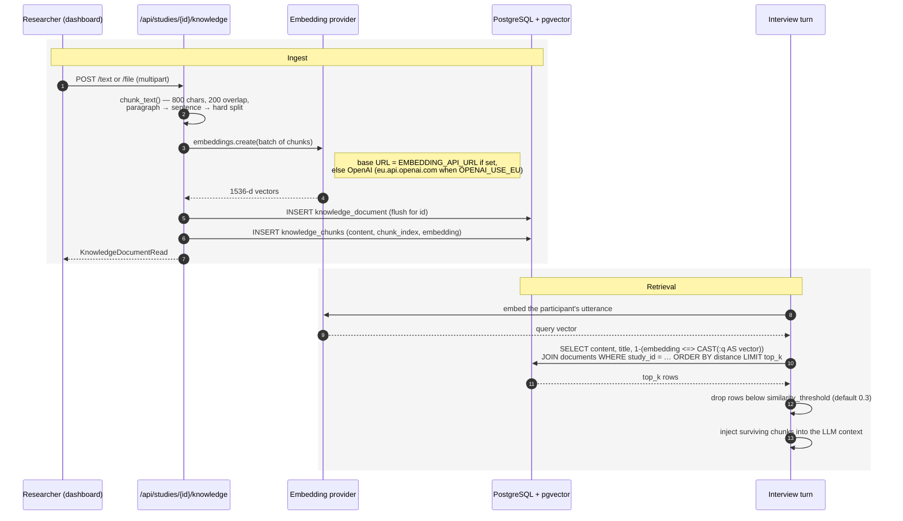

# Technical Design: OASIS — Open Agentic Survey Interview System

> **Provenance.** This document was reverse-engineered from the codebase on **2026-09-17**. It describes the system **as implemented**, not as specified. It has not been validated against stakeholder intent and must **not** be treated as approved requirements. Every design decision below is marked `_(inferred from code)_` unless it cites an existing approved document.

> **Status:** Complete. Phase 1 = technology selection, design patterns, folder structure, error handling, configuration & secrets. Phase 2 (added 2026-09-17) = Database Schema, Sequence Diagrams, Security Design.

Companion document: [`architecture.md`](architecture.md) (system overview, components, integrations, risk register). Subject-matter deep dives live in [`DEPLOYMENT.md`](DEPLOYMENT.md), [`ADAPTIVE_BEHAVIOR.md`](ADAPTIVE_BEHAVIOR.md), [`ENGAGEMENT_METRICS.md`](ENGAGEMENT_METRICS.md) and [`AUDIO_RECORDING.md`](AUDIO_RECORDING.md) and are not restated here.

## Technology Selection

All selections are `_(inferred from code)_` — reconstructed from manifests and implementation, with the rationale column stating the benefit the code appears to be taking, not a recorded decision.

### Backend

| Concern | Technology | Rationale as evidenced in code |
|---|---|---|
| Language / runtime | Python 3.12, `python:3.12-slim` base image | Matches the Pipecat and AI-SDK ecosystem; `backend/Dockerfile:1` |
| Web framework | FastAPI + uvicorn, fully async | Native WebSocket support alongside REST in one process, plus generated OpenAPI at `/api/openapi.json`; `backend/app/main.py` |
| Media pipeline | `pipecat-ai` 1.4.0 | Provides transport, VAD, turn-taking, aggregators and provider services as composable frame processors — the platform supplies only domain processors |
| Wire protocol (voice) | Pipecat `ProtobufFrameSerializer` over WebSocket | Compact binary framing for raw PCM; mirrored in the browser by `frontend/src/lib/pipecat-proto.ts` |
| ORM | SQLAlchemy 2 (declarative `Mapped[...]`) + asyncpg | Async end-to-end, no thread pool; `backend/app/database.py` |
| Migrations | Alembic, 17 revisions, applied on container start | `alembic upgrade head && uvicorn ...` in `backend/Dockerfile:16` — migrations are a deploy-time side effect of starting the backend |
| Database | PostgreSQL 16 via `pgvector/pgvector:pg16` | One store for relational data **and** RAG vectors, avoiding a separate vector database |
| Cache / broker | Redis 7 | Three distinct roles: session TTL registry, transcript pub/sub, runtime settings overrides |
| Auth | PyJWT, HS256, 24 h expiry | Minimal dependency for a single-operator deployment; `backend/app/auth.py:23-24` |
| Config | pydantic-settings `BaseSettings`, `.env`, `extra="ignore"` | Typed configuration with computed `database_url` properties; `backend/app/config.py` |
| Logging | `loguru` | Used uniformly across pipeline, API and lifecycle code |
| Object storage | boto3 (optional) | Only imported for the S3 backend; local filesystem is the default |
| Telephony | Twilio Media Streams (μ-law 8 kHz → PCM16) | Reuses the same Pipecat pipeline as the browser widget |

### Frontend

| Concern | Technology | Rationale as evidenced in code |
|---|---|---|
| Framework | React 18 | Standard SPA; `frontend/src/main.tsx` |
| Build | Vite + TypeScript | Fast dev loop; production bundle served statically by the frontend container |
| Routing | react-router-dom v6, nested routes | Participant and dashboard route trees are separated at the top level so the guard applies to one and not the other; `frontend/src/App.tsx` |
| Styling | Tailwind CSS | Utility classes throughout; no component library dependency |
| Realtime | Native `WebSocket` + `protobufjs` | Speaks the Pipecat frame protocol directly rather than via an SDK |
| Audio | Web Audio API (`MicCapture`, `AudioPlayer`) | Raw PCM capture and playback under app control; `frontend/src/lib/audio.ts` |
| Tests | Vitest | Unit tests colocated as `*.test.ts` |

### Delivery

| Concern | Technology | Notes |
|---|---|---|
| Edge / TLS | Caddy 2 alpine | Automatic certificate provisioning when the site block is a domain; `docker/Caddyfile` |
| Orchestration | Docker Compose, five services, one bridge network | Only Caddy publishes ports (80/443) |
| CI | GitHub Actions — pytest + coverage, Vitest, `tsc --noEmit`, both Docker builds | No paid API keys required; all provider calls mocked (`.github/workflows/ci.yml`) |
| Scheduled checks | `.github/workflows/weekly.yml` | Implies awareness of provider/model drift (risk R8) |
| Install / update | `scripts/install.sh`, `scripts/update.sh` | Operator entry points; see [`DEPLOYMENT.md`](DEPLOYMENT.md) |

## Design Patterns

Patterns identified in the implementation _(all inferred from code)_:

- **Layered request handling.** `api/<resource>.py` (routing + HTTP concerns) → `schemas/<resource>.py` (Pydantic validation and response shaping) → `models/<resource>.py` (SQLAlchemy persistence). There is no separate service or repository layer; business logic sits in the router functions. This is consistent and deliberate, but means domain rules are reachable only through HTTP entry points.
- **Pipes and filters (Pipecat frame processors).** The core runtime pattern. Each concern — transcript logging, engagement scoring, adaptive policy, interview-guide nudging, audio tapping — is an independent `FrameProcessor` composed into an ordered pipeline by `pipeline/runner.py`. Features are enabled per agent by including or omitting a processor rather than by branching inside one.
- **Abstract factory / strategy for pipelines.** `runner.py` selects between the modular and voice-to-voice topologies and injects the correct provider services based on the agent row and the resolved catalog entry.
- **Strategy for storage.** `audio/storage.py` defines the `AudioStorageBackend` ABC with local-filesystem and S3 implementations chosen by configuration; `build_session_prefix()` centralises key layout.
- **Registry / catalog.** `providers/catalog.py` holds immutable (`frozen=True`) dataclass options as a single source of truth shared by the dashboard UI, request validation and runtime routing — preventing the three from diverging.
- **Guard / pre-flight validation.** `providers/validate.py::validate_agent_pipeline_config()` is invoked before pipeline construction so misconfiguration surfaces as a clean WebSocket close rather than a mid-interview failure.
- **Publish/subscribe fan-out.** `realtime.py` decouples transcript producers (pipelines) from consumers (monitor sockets) over a per-session Redis channel. Note the deliberate constraint documented in code: pub/sub requires a dedicated connection, so each subscriber creates its own Redis client (`realtime.py:41-46`).
- **Lease with TTL + reaper.** Redis session keys act as leases; `session_cleanup_loop` reconciles expired leases back into Postgres as `timed_out`. Crash-safety comes from expiry, not from cleanup code running.
- **Dependency injection.** FastAPI `Depends` for database sessions (`get_db`) and authentication (`require_auth`), applied at router-inclusion level so protection is declared once per router.
- **Layered configuration resolution.** Redis override → environment/`.env` → typed default. See § Configuration & Secrets Resolution.
- **Prompt-as-implementation.** Structured interview behaviour is expressed as a generated system prompt plus a lightweight counter, not as application state (`pipeline/interview_guide.py`). Worth flagging to reviewers: interview logic is partly non-deterministic and lives in prompt text.

## Folder Structure

### Repository root

```
oasis-platform/
├── backend/           FastAPI application, migrations, tests
├── frontend/          React + Vite SPA
├── docker/            Caddyfile (edge routing + TLS)
├── docs/              This document set + subject deep dives
├── scripts/           install.sh, update.sh, verify_providers.py
├── misc/              system-diagram.svg and assets
├── .github/workflows/ ci.yml, weekly.yml
├── docker-compose.yml Five-service stack
└── .env.example       Full configuration surface
```

### Backend (`backend/app/`)

```
app/
├── main.py                  App factory, lifespan, CORS, router mounting,
│                            public /api/widget/{key} and /api/health
├── config.py                pydantic-settings Settings (single config surface)
├── database.py              Async engine, session factory, get_db dependency
├── redis.py                 Shared Redis client + close_redis
├── auth.py                  JWT create/verify + require_auth dependency
├── realtime.py              Per-session transcript pub/sub (publish + subscribe)
├── session_manager.py       Redis session leases, active set, zombie reaper loop
├── api/                     HTTP + WebSocket entry points
│   ├── router.py            Aggregates the 8 /api routers; applies require_auth
│   ├── auth.py              Public: login, status
│   ├── studies.py agents.py sessions.py analytics.py
│   ├── participants.py knowledge.py settings.py templates.py
│   ├── interviews.py        WS /ws/interview/{widget_key}   (voice)
│   ├── text_chat.py         WS /ws/chat/{widget_key}        (text)
│   ├── monitor.py           WS /ws/monitor/{session_id}     (researcher, JWT)
│   └── twilio.py            POST /api/twilio/voice/{agent_id} + WS media stream
├── schemas/                 Pydantic request/response models
│   └── study.py agent.py session.py participant.py analytics.py
├── models/                  SQLAlchemy entities
│   ├── base.py              DeclarativeBase: UUID pk, created_at, updated_at
│   └── study.py agent.py session.py engagement.py knowledge.py
├── pipeline/                Pipecat composition + domain frame processors
│   ├── runner.py            Pipeline factory (modular vs voice-to-voice)
│   ├── interview_guide.py   Structured-prompt builder + advance nudger
│   ├── engagement_processor.py  Per-turn scoring hook
│   ├── adaptive_processor.py    Policy evaluation + action injection
│   └── transcript_logger.py     Persist entries + publish to Redis
├── providers/               catalog.py availability.py validate.py smoke.py
├── engagement/              features.py scorer.py events.py adaptive.py
│                            (pure logic, no I/O — see ENGAGEMENT_METRICS.md)
├── audio/                   recording.py (taps + manager), storage.py (backends)
└── knowledge/               embeddings.py (chunk, embed, pgvector search)

alembic/versions/            17 revisions — schema history
tests/                       29 pytest modules, mirroring the module layout
```

Two structural conventions worth preserving _(inferred)_: `engagement/` holds **pure, I/O-free logic** while `pipeline/` holds the Pipecat adapters that call it — which is why engagement logic is directly unit-testable; and the three participant-facing WebSocket routers are mounted outside `api_router` precisely because they must not inherit `require_auth`.

### Frontend (`frontend/src/`)

```
src/
├── main.tsx                 Vite entry — mounts <App/>
├── App.tsx                  Route tree + RequireAuth guard
├── contexts/AuthContext.tsx Auth state: loading, authEnabled, authenticated
├── pages/                   Route-level screens
├── components/              Shared and form-fragment components
└── lib/                     Non-visual modules
```

**Route map** (`App.tsx`) — note the deliberate split: the participant route is declared **before** and outside the guarded subtree.

| Path | Page | Guard |
|---|---|---|
| `/interview/:widgetKey` | `InterviewPage` | **None** — participant-facing widget |
| `/login` | `LoginPage` | None; redirects to `/` when auth is disabled or already authenticated |
| `/` | `StudyListPage` | `RequireAuth` |
| `/studies/:studyId` | `StudyDetailPage` | `RequireAuth` |
| `/studies/:studyId/agents/:agentId` | `AgentFormPage` | `RequireAuth` |
| `/studies/:studyId/agents/:agentId/sessions` | `SessionListPage` | `RequireAuth` |
| `/studies/:studyId/agents/:agentId/sessions/:sessionId` | `SessionDetailPage` | `RequireAuth` |
| `/settings` | `SettingsPage` | `RequireAuth` |

`RequireAuth` renders a spinner while `AuthContext` is `loading`, redirects to `/login` when `authEnabled && !authenticated`, and otherwise renders children wrapped in `Layout`. Because `authEnabled` is server-reported, the guard is inert when the backend has auth disabled — the UI is not the security boundary.

**Component inventory** (`components/`):

| Component | Role |
|---|---|
| `Layout` | Dashboard chrome/navigation wrapper for all guarded routes |
| `AdaptiveBehaviorToggle`, `AdaptivePolicyFields` | Agent-form fragments for adaptive policy (see [`ADAPTIVE_BEHAVIOR.md`](ADAPTIVE_BEHAVIOR.md)) |
| `TrackEngagementToggle`, `EngagementConfigFields` | Agent-form fragments for engagement config (see [`ENGAGEMENT_METRICS.md`](ENGAGEMENT_METRICS.md)) |
| `StoreAudioToggle` | Per-agent audio recording opt-in (see [`AUDIO_RECORDING.md`](AUDIO_RECORDING.md)) |
| `TemplatePicker` | Applies a starter agent template from `/api/templates` |
| `SettingsCollapsibleSection` | Grouping for the provider/keys settings screen |
| `HelpTooltip`, `CopyButton`, `Toast`, `Tutorial` | Cross-cutting UI affordances |

**`lib/` modules:**

- `api.ts` — the only HTTP entry point. A `request<T>()` wrapper over `fetch` against the `/api` base that attaches `Authorization: Bearer` from `localStorage`, returns `undefined` for `204`, centrally handles `401` (clear token, redirect to `/login`), and otherwise throws a formatted error. Exposes namespaced clients: `auth`, `studies`, `agents`, `sessions`, `participants`, `knowledge`, `templates`, `widget`, `settingsApi`, plus `downloadAuthed()` for authenticated CSV/JSON/audio downloads and the engagement/adaptive default constants shared with the agent form.
- `pipecat-proto.ts` — `encodeAudioFrame()` / `decodeFrame()` over protobufjs; the browser half of the Pipecat wire protocol.
- `audio.ts` — `MicCapture` (microphone → PCM frames) and `AudioPlayer` (queued PCM playback), both unit-tested.
- `apiErrors.ts` — `formatApiError()` normalises FastAPI `detail` payloads (string, validation-error array, or object) into one display string; also hosts local-date ISO helpers and widget hex-colour validation.
- `colors.ts` — hex→rgb(a) helpers for per-agent widget theming.

Frontend contributor note: token storage is `localStorage` under `oasis_auth_token` (`api.ts:14`), which is relevant to the Phase 2 security review.

## Error Handling Strategy

Observed behaviour, layer by layer _(all inferred from code)_:

**Database.** `get_db()` yields an `AsyncSession`, commits on clean exit, and rolls back then re-raises on any exception (`database.py:24-32`) — so a failed request never leaves a partial transaction. `pool_pre_ping=True` transparently recovers stale connections after a Postgres restart.

**REST API.** Errors are raised as `HTTPException` with a `detail` payload; FastAPI/Pydantic supply `422` for validation failures. `require_auth` returns `401` with a `WWW-Authenticate: Bearer` header. There is **no global exception handler**, so an unhandled exception surfaces as a generic `500` — and with `debug=True` (the default) SQLAlchemy `echo` is also on, so query text reaches the logs.

**WebSocket planes.** Failures are communicated as application-defined close codes rather than exceptions, giving the widget actionable feedback:

| Code | Meaning | Source |
|---|---|---|
| `4004` | Agent not found or inactive | `api/interviews.py:65` |
| `4005` | Wrong modality (text agent on the voice endpoint) | `api/interviews.py:74` |
| `4401` | Missing/invalid JWT on the monitor socket | `api/monitor.py:52` |

Provider misconfiguration is caught before the pipeline is built by `validate_agent_pipeline_config()`, so participants get an immediate, explicable failure instead of a silent dead air.

**Pipeline and lifecycle.** Long-running work is defended by timeouts rather than error handling: a hard `_MAX_PIPELINE_SECONDS = 7200` ceiling per pipeline, a Redis TTL lease per session, and the reaper loop that reconciles anything left behind. The reaper wraps each cleanup in its own try/except so one bad session cannot kill the loop (`session_manager.py:107-108`).

**Degradation-by-design.** Several paths choose to continue rather than fail:
- A failed transcript publish logs a warning and proceeds — live monitoring is best-effort, persistence is not (`realtime.py:29-30`).
- The EU data-residency flag lookup falls back to the static setting if Redis is unavailable (`pipeline/runner.py:67-73`).
- Provider availability falls back from Redis override to env on `RedisError` (`providers/availability.py:33-35`).

Note the asymmetry: Redis is **required at startup** (the lifespan hook pings it and startup fails if unreachable, `main.py:33-34`) but individual reads degrade gracefully at runtime.

**Client.** `api.ts::request()` funnels every failure through `formatApiError()`, treats `401` as a session-ended signal (clear token, redirect), and surfaces the rest as thrown `Error`s for the calling page to render — typically via `Toast`.

**Health.** `/api/health` probes API, Postgres and Redis independently and returns a per-service status plus an aggregate `healthy` boolean. It is unauthenticated and returns the raw exception string on failure (`main.py:147-174`) — flagged for Phase 2 review as an information-disclosure consideration.

## Configuration & Secrets Resolution

This section exists because the precedence rules are non-obvious, undocumented elsewhere, and directly relevant to both operations and security _(all inferred from code)_.

### Resolution order

For any provider credential or feature flag, the effective value is resolved at **call time**, not at startup:

```
1. Redis override   — hash oasis:settings:api_keys  (or oasis:settings:flags)
2. Environment/.env — loaded by pydantic-settings into Settings
3. Typed default    — the field default in backend/app/config.py
```

`get_effective_key(field)` performs an `HGET` on the Redis hash and returns the override if present, otherwise the `Settings` attribute (`api/settings.py:135-144`). Flags follow the same shape via `get_effective_flag`. Consequences to be aware of:

- **Dashboard edits take effect immediately and without restart** — this is the intended operator benefit (decision D5 in `architecture.md`).
- **A Redis override silently outranks `.env`.** An operator who "fixes" a key in `.env` and redeploys will see no change if a dashboard override exists. `GET /api/settings/keys` reports a `source` field (`env` / `dashboard` / `none`) specifically to make this visible; that field is the diagnostic to reach for.
- **Overrides live in Redis, not Postgres**, so they share Redis's durability and access posture (risk R7).

### Configuration surface

`backend/app/config.py` is the single declaration of every setting, grouped as: application (`APP_ENV`, `SECRET_KEY`, `DEBUG`), PostgreSQL (with computed async and sync URL properties — the sync one exists solely for Alembic), Redis, AI provider credentials, OpenAI EU data residency, self-hosted STT/TTS/embedding/smart-turn endpoints, Twilio, authentication, and audio storage. `extra="ignore"` means unknown `.env` keys are silently dropped — convenient, but typos in variable names fail quietly. `.env.example` is the operator-facing catalogue of the same surface.

Roughly 28 fields are writable from the dashboard (`_API_KEY_FIELDS`, `api/settings.py:47+`); values are masked on read. Exactly one boolean flag is currently exposed: `openai_use_eu` (`_FLAG_FIELDS`, `api/settings.py:34-36`).

### Provider readiness

`providers/availability.py` maps each provider to its required fields — e.g. `azure` needs key, endpoint **and** API version; `custom` needs only a base URL — and resolves them through the same override chain. `azure` and `gcp` are currently in `_DISABLED_PROVIDERS` and always report unconfigured regardless of credentials (`availability.py:26`), which is a deliberate gate rather than a bug, but is invisible to an operator who has supplied those credentials.

### Secrets handling posture (Phase 2 detail)

Recorded here for continuity, analysed in § Security Design: secrets reach the backend via `env_file: .env` in Compose, may be duplicated into Redis by dashboard edits, are masked on API read, and the JWT signing key is the same `SECRET_KEY` that defaults to a published placeholder.

---

## Database Schema

Entity semantics, relationships and the ERD live in [`architecture.md`](architecture.md) § Data Model. This section is the physical view: columns, types, indexes, constraints and migration lineage _(all inferred from `backend/app/models/` and `backend/alembic/versions/`)_.

### Engine and session setup (`backend/app/database.py`)

```python
engine = create_async_engine(settings.database_url, echo=settings.debug, pool_pre_ping=True)
async_session_factory = async_sessionmaker(engine, class_=AsyncSession, expire_on_commit=False)
```

Four properties matter downstream _(inferred)_:

- **Driver** is `postgresql+asyncpg`, composed by the `database_url` property in `config.py`; a second `sync` URL property exists solely so Alembic can run with psycopg.
- **`echo=settings.debug`** ties SQL statement logging to the same flag that defaults to `True` — so the default posture logs query text (see R1).
- **`expire_on_commit=False`** lets handlers keep using ORM objects after commit; the interview WebSocket relies on this when it snapshots agent config.
- **Pool sizing is left at the SQLAlchemy default** (5 + 10 overflow). No pool tuning appears anywhere, which is a scale input for R6 given each live pipeline also opens short-lived sessions via `async_session_factory` directly (outside the `get_db` request scope).

### Tables

Every table carries the `Base` triplet: `id UUID PRIMARY KEY` (v4, generated in Python), `created_at TIMESTAMPTZ NOT NULL DEFAULT now()`, `updated_at TIMESTAMPTZ NOT NULL DEFAULT now()` with `onupdate`. Only the distinguishing columns are listed.

| Table | Key columns | Constraints and notes |
|---|---|---|
| `studies` | `title VARCHAR(255) NOT NULL`, `description TEXT`, `status study_status DEFAULT 'draft'` | Root of the ownership tree |
| `agents` | `study_id UUID NOT NULL`, `name VARCHAR(255)`, `system_prompt TEXT NOT NULL`, `welcome_message TEXT`, `modality agent_modality`, `pipeline_type pipeline_type`, `interview_mode interview_mode`, `participant_id_mode participant_id_mode`, `status agent_status DEFAULT 'active'`, `llm_model VARCHAR(255)`, `stt_provider/stt_model`, `tts_provider/tts_model/tts_voice`, `turn_detection VARCHAR(20) DEFAULT 'local'`, `language VARCHAR(10) DEFAULT 'en'`, `max_duration_seconds INT NULL`, `silence_timeout_seconds INT NULL`, `silence_prompt TEXT`, `widget_* ` theming columns, `store_audio`/`track_engagement`/`adaptive_enabled`/`widget_show_progress BOOLEAN DEFAULT false`, `interview_guide`/`engagement_config`/`adaptive_policy JSON`, `twilio_phone_number VARCHAR(30)` | `study_id → studies.id ON DELETE CASCADE`; **`widget_key VARCHAR(32) NOT NULL UNIQUE`** — the only unique constraint outside primary keys, and the participant capability token (`secrets.token_urlsafe(16)`) |
| `participant_identifiers` | `agent_id UUID NOT NULL`, `identifier VARCHAR(255) NOT NULL`, `label VARCHAR(255)`, `used BOOLEAN DEFAULT false`, `session_id UUID NULL` | `agent_id → agents.id ON DELETE CASCADE`; `session_id → sessions.id ON DELETE SET NULL`. **No unique constraint on `(agent_id, identifier)`** — duplicate identifiers are possible, and lookup uses `scalar_one_or_none()` |
| `sessions` | `agent_id UUID NOT NULL`, `status session_status DEFAULT 'active'`, `duration_seconds DOUBLE PRECISION`, `total_tokens INT DEFAULT 0`, `ended_at TIMESTAMPTZ`, `participant_id VARCHAR(255)`, `audio_recording_enabled BOOLEAN`, `audio_storage_uri VARCHAR(1024)`, `audio_recording_status VARCHAR(32) DEFAULT 'none'`, `adaptive_active BOOLEAN` | `agent_id → agents.id ON DELETE CASCADE`. `audio_recording_status` is a **string, not a DB enum** — values come from the Python `AudioRecordingStatus` only |
| `transcript_entries` | `session_id UUID NOT NULL`, `role speaker_role NOT NULL`, `content TEXT NOT NULL`, `sequence INT NOT NULL`, `prompt_tokens INT`, `completion_tokens INT`, `spoken_at TIMESTAMPTZ DEFAULT now()` | `session_id → sessions.id ON DELETE CASCADE`. **No index on `session_id`, and no unique constraint on `(session_id, sequence)`**; ordering is applied in the ORM relationship |
| `engagement_turns` | `session_id UUID NOT NULL`, `transcript_sequence INT NOT NULL`, `response_latency_ms`, `voiced_ms`, `word_count`, `char_count INT`, `speech_rate_wpm`, `rms_energy`, `score DOUBLE PRECISION`, `filler_count INT`, `label VARCHAR(16)`, `extras JSON` | `ON DELETE CASCADE`; **indexed** `ix_engagement_turns_session_id` |
| `engagement_events` | `session_id UUID NOT NULL`, `transcript_sequence INT`, `event_type VARCHAR(64) NOT NULL`, `score_at_event DOUBLE PRECISION`, `payload JSON` | `ON DELETE CASCADE`; **indexed** `ix_engagement_events_session_id` |
| `adaptive_actions` | `session_id UUID NOT NULL`, `transcript_sequence INT`, `trigger VARCHAR(64) NOT NULL`, `action VARCHAR(64) NOT NULL`, `mode VARCHAR(16) NOT NULL`, `detail JSON` | `ON DELETE CASCADE`; **indexed** `ix_adaptive_actions_session_id`. `mode` (`live`/`shadow`) is a plain string |
| `knowledge_documents` | `study_id UUID NOT NULL`, `title VARCHAR(500) NOT NULL`, `source_type VARCHAR(50) DEFAULT 'text'`, `content_length INT`, `chunk_count INT` | `study_id → studies.id ON DELETE CASCADE`. Original document bytes are **not** retained — only derived chunks |
| `knowledge_chunks` | `document_id UUID NOT NULL`, `content TEXT NOT NULL`, `chunk_index INT NOT NULL`, **`embedding VECTOR(1536) NULL`** | `document_id → knowledge_documents.id ON DELETE CASCADE` |

### Enum types

Eight PostgreSQL enums, all created with `values_callable` so stored labels are the lowercase member **values**: `study_status`, `agent_modality`, `agent_status`, `pipeline_type`, `interview_mode`, `participant_id_mode`, `session_status` (`active`, `completed`, `timed_out`, `error`), `speaker_role`. Adding a member requires an `ALTER TYPE … ADD VALUE` migration, so enum churn is a deliberate friction point _(inferred)_.

### Vectors and indexing

`pgvector` is enabled by `op.execute('CREATE EXTENSION IF NOT EXISTS vector')` in revision `93ccd082bff1`; `EMBEDDING_DIMENSIONS = 1536` is pinned in `models/knowledge.py` to match `text-embedding-3-small`. Retrieval uses the cosine-distance operator `<=>` in raw SQL, cast as `CAST(:query_embedding AS vector)` rather than `::vector` because `text()` would otherwise read `::` as bind-parameter syntax (`knowledge/embeddings.py:244-257`).

Two index observations for implementers _(inferred, not tested)_:

- **No ANN index exists on `knowledge_chunks.embedding`** — no `ivfflat` or `hnsw` is created in any migration, so similarity search is an exact scan over the study's chunks. Correct, and fine at small corpus sizes; a capacity consideration, not a bug.
- **Only three non-PK indexes exist in the whole schema** (the three `ix_*_session_id` above). The hot read paths `transcript_entries.session_id`, `sessions.agent_id`, `agents.study_id`, `knowledge_chunks.document_id` and `participant_identifiers.agent_id` are unindexed. A dashboard session list or monitor backfill therefore scales with table size.
- Changing `EMBEDDING_DIMENSIONS` (e.g. to use a different embedding model) is a **breaking schema change**: the column is fixed-width and existing vectors would not be comparable.

### Migration lineage

17 revisions in `backend/alembic/versions/`, a single linear chain with no branches or merges. Applied as a container start-up side effect (`alembic upgrade head && uvicorn …`, `backend/Dockerfile:16`), so a failed migration prevents the backend from serving at all — there is no "start without migrating" path.

```
53b7bae909ec  studies + agents                (root)
af8324aeafb6  sessions + transcript_entries
2bdd8f712d28  widget config + participant_identifiers
4a07d0afd329  widget listening message
7e13033c586a  twilio phone number
93ccd082bff1  knowledge base tables  ← CREATE EXTENSION vector
8b30eb23a410  silence handling fields
a1c2d3e4f5g6  structured interview fields
b2c3d4e5f6g7  modality + avatar
c9a17bd5b3a1  default agent status → active
d4e5f6a7b8c9  audio recording fields
e7f8a9b0c1d2  engagement metrics (engagement_turns)
f1a2b3c4d5e6  engagement events + config
a1b2c3d4e5f6  adaptive behavior
b2c3d4e5f6a7  updated_at on engagement tables
c3d4e5f6a7b8  widget show progress
d5e6f7a8b9c0  turn detection                   (head)
```

Notable _(inferred)_: the lineage reads as a clean feature history — core → telephony → RAG → structured interviews → audio → engagement → adaptive. Two operational cautions: revision ids are a mix of generated hashes and hand-written ids (`a1b2c3d4e5f6` vs `a1c2d3e4f5g6` differ by one character and sit in the same chain), and the `downgrade()` of `93ccd082bff1` executes `DROP EXTENSION IF EXISTS vector`, which would affect anything else in that database using pgvector.

## Sequence Diagrams

All four diagrams are `_(inferred from code)_`; file:line anchors are given so a reviewer can re-derive each.

### 1. Voice interview — join to teardown

Sources: `api/interviews.py`, `providers/validate.py`, `session_manager.py`, `pipeline/runner.py`, `pipeline/transcript_logger.py`, `realtime.py`, `api/monitor.py`.

```mermaid
sequenceDiagram
    autonumber
    participant W as Participant widget
    participant WS as /ws/interview/{widget_key}
    participant PG as PostgreSQL
    participant RD as Redis
    participant PL as Pipecat pipeline
    participant EXT as Providers (STT/LLM/TTS)
    participant MON as Monitor socket

    W->>WS: connect (?pid=…)
    WS->>WS: accept() — before any auth check
    WS->>PG: SELECT agent WHERE widget_key AND status=active
    alt not found / text-modality / config invalid
        WS-->>W: {"error": …} then close 4004 / 4005 / 4006
    else ok
        WS->>WS: validate_agent_pipeline_config() (pre-flight gate)
        WS->>WS: snapshot agent config (detached dict)
        alt participant_id_mode = predefined
            WS->>PG: SELECT participant_identifier
            WS-->>W: close 4003 if missing / unknown / already used
        else random
            WS->>WS: secrets.token_urlsafe(8)
        else input
            WS-->>W: close 4003 if pid blank
        end
        WS->>PG: INSERT session (status=active, adaptive_active, audio flags)
        WS->>PG: UPDATE participant_identifier SET used, session_id
        WS->>RD: SET oasis:session:{id} EX max_duration+120 ; SADD active_sessions
        WS->>PL: build_pipeline(websocket, session_id, agent cfg…)
        PL->>EXT: open provider streams
        PL-->>W: welcome message (TTS audio frames)
        loop each turn
            W->>PL: PCM frames (protobuf)
            PL->>EXT: STT → LLM → TTS (or V2V realtime)
            PL-->>W: PCM frames (protobuf)
            PL->>PG: INSERT transcript_entry (background task)
            PL->>RD: PUBLISH oasis:transcript:{session_id}
            RD-->>MON: transcript event
        end
        Note over WS,PL: runner.run() wrapped in asyncio.wait_for<br/>timeout = min(max_duration+60, 7200)
        W--xPL: disconnect / EndFrame / timeout
        PL->>PL: cleanup(): flush agent buffer, drain writes, finalize audio
        WS->>PG: UPDATE session status/ended_at/duration/total_tokens/audio_uri
        WS->>RD: PUBLISH session_ended
        RD-->>MON: session_ended → monitor closes
        WS->>RD: DEL session key ; SREM active_sessions
    end
```

Two details worth carrying into implementation _(inferred)_: transcript persistence is **fire-and-forget** — `persist_entry()` assigns the sequence number synchronously but performs the DB write and Redis publish in a background task so the audio path is never blocked (`transcript_logger.py:64-91`); and the monitor never talks to the pipeline directly — it backfills from Postgres, then joins the Redis channel, so a monitor that connects late still sees the whole conversation.

### 2. Twilio inbound call

Source: `api/twilio.py`.

```mermaid
sequenceDiagram
    autonumber
    participant C as PSTN caller
    participant T as Twilio
    participant API as POST /api/twilio/voice/{agent_id}
    participant WS as WS /ws/twilio/{agent_id}
    participant PG as PostgreSQL
    participant PL as Pipecat pipeline

    C->>T: dials the study number
    T->>API: POST form (To, From, CallSid…) — no signature check found (R4)
    API->>PG: resolve agent by path id OR twilio_phone_number = To
    alt missing / non-voice / fails provider gate
        API-->>T: TwiML <Say> apology + <Hangup/>
    else ok
        API-->>T: TwiML <Connect><Stream url="wss://{Host}/ws/twilio/{agent}">
        T->>WS: WebSocket connect
        T->>WS: {"event":"connected"}
        T->>WS: {"event":"start", streamSid, callSid, customParameters}
        Note over WS: 10 s timeout waiting for "start"; close if absent
        WS->>PG: re-resolve agent (active + voice) → close 4004 / 4005
        WS->>PG: INSERT session
        WS->>PL: build pipeline with μ-law 8 kHz serializer
        loop call audio
            T->>WS: {"event":"media", payload: base64 μ-law}
            WS-->>T: {"event":"media", payload: base64 μ-law}
        end
        T->>WS: {"event":"stop"}
        WS->>PG: finalise session
    end
```

### 3. RAG ingest and retrieval

Sources: `api/knowledge.py`, `knowledge/embeddings.py`, `api/text_chat.py:111` (`_maybe_inject_rag_context`).



Note the scoping rule _(inferred)_: retrieval filters on `knowledge_documents.study_id`, so an agent can only ever retrieve from **its own study's** corpus. The threshold filter is applied in Python *after* the `LIMIT`, so a low-relevance corpus returns fewer than `top_k` rows rather than padding with noise. `POST …/knowledge/search` exposes the same function to researchers for retrieval testing.

### 4. Session status state machine

Sources: `api/interviews.py:233-330`, `api/sessions.py:653-694`, `session_manager.py`.

```mermaid
stateDiagram-v2
    [*] --> active : INSERT on WebSocket connect<br/>+ Redis lease (ttl = max_duration + 120s)

    active --> completed : pipeline ends cleanly<br/>(participant disconnect / EndFrame)
    active --> completed : POST …/{session_id}/terminate<br/>(admin; publishes session_ended)
    active --> timed_out : asyncio.wait_for ceiling<br/>min(max_duration+60, 7200)s
    active --> timed_out : zombie reaper — Redis key expired<br/>but id still in oasis:active_sessions
    active --> error : unhandled pipeline exception

    completed --> [*]
    timed_out --> [*]
    error --> [*]

    note right of active
      Reaper: session_cleanup_loop, every 60 s
      duration computed as ended_at - created_at
      each cleanup in its own try/except
    end note
```



Three points a reviewer should not have to rediscover _(inferred)_: there is **no `terminated` status** — administrative termination records `completed`, so admin-ended and participant-ended sessions are indistinguishable in the data; the reaper only transitions rows still marked `active`, making it idempotent; and every terminal transition is written by the WebSocket handler's `finally` block, which wraps its own work in try/except so a finalisation failure is logged rather than raised (leaving a row for the reaper).

## Security Design

**Primary handoff to the Security Reviewer.** Everything below is `_(inferred from code)_` by reading the implementation. No testing, no exploitation, and no validation against a threat model was performed; severities are an architect's triage input only. Controls are described as *observed in code*, not as *verified effective*.

### Risk register carried forward (R1–R9)

IDs, wording and evidence paths are preserved from [`architecture.md`](architecture.md) § Technical Risks. Two columns are added: the control actually present in code, and the residual exposure after it.

| ID | Risk (abbreviated) | Inferred severity | Control observed in code | Residual (inferred) |
|---|---|---|---|---|
| R1 | Insecure defaults: `auth_enabled=False`, `debug=True`, placeholder `secret_key` | High | `scripts/install.sh` sets `DEBUG=false`, `AUTH_ENABLED=true`, generates `SECRET_KEY` via `openssl rand -hex 32` and prompts for `AUTH_PASSWORD` (`install.sh:195-208`). `GET /api/settings/auth` reports the state | The safe posture depends entirely on the operator using the installer. A manual `cp .env.example .env` yields `DEBUG=true`, `AUTH_ENABLED=false` and the published placeholder key (`.env.example:11,12,88`). Nothing in the app refuses to start on the placeholder secret |
| R2 | CORS `allow_origins=["*"]` with `allow_credentials=True` when `debug` | High | `main.py:63` narrows to `[]` when `debug` is false — the installer sets that | While `debug=true`, the permissive combination is active on the same origin that serves the admin API. No allow-list setting exists for legitimate cross-origin use |
| R3 | No session invalidation; stateless HS256 JWT, fixed 24 h expiry | Medium-High | Signature and `exp` are verified on every request (`auth.py:39-49`); the frontend clears its token on `401` (`lib/api.ts`) | No logout endpoint, denylist, `jti`, refresh or rotation. A leaked token is valid until `exp`; rotating `SECRET_KEY` (a restart) is the only revocation. Token is held in `localStorage` (`frontend/src/lib/api.ts:14`) and additionally travels in a **query string** on the monitor socket, where it may reach access logs |
| R4 | Twilio webhook signature validation not found | High — **confirm first (OQ1)** | Agent resolution + modality + provider gate reject unknown targets with a `<Say>`/`<Hangup/>` TwiML; no `RequestValidator` or `X-Twilio-Signature` handling exists anywhere under `backend/app` | `POST /api/twilio/voice/{agent_id}` is reachable without credentials, and the returned `<Stream url>` is built from the inbound `Host` header (`twilio.py:145`). `/ws/twilio/{agent_id}` likewise accepts any client that sends a Twilio-shaped `start` event. **Do not close OQ1 by assumption** — confirm whether an edge control exists |
| R5 | Single shared operator identity; no roles or attribution | Medium | Credentials come from `.env` and the login endpoint is the only issuance path | Plaintext password compared with `!=` (non-constant-time, `api/auth.py:56`), no hashing at rest, no rate limiting, lockout or login audit. Every action over participant PII is attributable only to "the operator" |
| R6 | Pipelines co-located with the API loop; single replica assumed | Medium | 2 h hard ceiling, Redis TTL lease, reaper loop, `pool_pre_ping` | Availability/DoS-shaped rather than confidentiality-shaped. No backpressure, connection cap, or per-`widget_key` rate limit on interview connects; each monitor subscriber opens its own Redis connection (`realtime.py:41-46`) |
| R7 | Provider API keys persisted in Redis | Medium | Values masked on read (`_mask_key`, `api/settings.py:79`); `source` field distinguishes `env`/`dashboard`/`none`; Redis is not published to the host | Redis runs without `requirepass` on `oasis_net` (`docker-compose.yml:73-86`), so isolation is the only boundary; any container on that network, or anyone with `docker exec`, can read plaintext keys. Writes are unaudited |
| R8 | Hard-coded provider/model catalog drifts as vendors retire models | Medium | `weekly.yml` scheduled check; `validate_agent_pipeline_config()` fails closed at connect (close `4006`) rather than mid-interview; `POST /settings/smoke-test` for live verification | Drift surfaces as an interview that cannot start. Availability/quality risk, not a confidentiality one |
| R9 | No retention or deletion policy for transcripts or recordings | Medium | FK `ON DELETE CASCADE` throughout; audio opt-in per agent (`store_audio`); recordings served only through authenticated endpoints | No TTL, no scheduled purge, no per-participant erasure path, no deletion audit. Recordings sit on a host bind mount (`docker-compose.yml:48`) and are not removed when their session row is deleted. Deleting a study destroys all derived research data irreversibly and silently |

### Authentication and session model

Single shared operator identity _(inferred, decision D7)_. `POST /api/auth/login` compares `AUTH_USERNAME` / `AUTH_PASSWORD` from settings and returns an HS256 JWT signed with `SECRET_KEY`, carrying only `sub`, `iat`, `exp` (+24 h, `auth.py:23-34`). `require_auth` is a FastAPI dependency applied at router-inclusion level; when `auth_enabled` is false it returns `None` and **every protected route passes** (`auth.py:62-63`).

Three behaviours a reviewer should note explicitly _(inferred)_:

- With auth disabled, `POST /auth/login` still issues a valid token for **any** credentials (`api/auth.py:45-48`), and `GET /auth/status` reports `authenticated: true`.
- `GET /auth/status` is public by design so the SPA can decide whether to render the login page; `AuthContext`/`RequireAuth` therefore mirror a server-reported flag. The UI is **not** the security boundary.
- There is no `/logout` on the server; sign-out is a client-side `localStorage` clear only.

### Authorization boundaries

Four distinct trust zones exist, and they do not share a mechanism _(inferred)_:

| Zone | Credential | Enforcement | Notes |
|---|---|---|---|
| Admin REST (`/api/*`, 8 routers) | JWT Bearer | `Depends(require_auth)` per router (`api/router.py:27-34`) | All-or-nothing; no per-study or per-agent scoping, because there is only one identity |
| Public REST | none | by design | `/api/auth/*`, `/api/widget/{widget_key}`, `/api/health`, `/api/docs`, `/api/openapi.json`. Health returns raw exception strings on failure (`main.py:162-171`) and the OpenAPI document publishes the full admin surface |
| Participant WS planes | `widget_key` possession (decision D6) | Agent lookup by `widget_key` + `status=active`; `predefined` mode additionally requires an unused `ParticipantIdentifier` | `websocket.accept()` happens **before** any check, so every connection is established and then closed with a `40xx` code. Effectively unauthenticated by design; the key is a bearer capability that lives in a URL |
| Twilio plane | none found | agent/modality/provider-gate checks only | See R4 |

The monitor plane is the one WebSocket that does authenticate — JWT via `?token=`, rejected with close `4401` **before** `accept()` (`api/monitor.py:47-56`), and only when `AUTH_ENABLED` is on.

Nested-path handlers consistently re-validate the ancestor chain (`_get_agent_or_404`, `_get_session_with_agent`) and return `404` on mismatch, so a wrong `study_id`/`agent_id` pairing cannot reach a child resource. With a single operator this is correctness rather than tenancy isolation _(inferred)_.

### Secrets handling

Resolution precedence is documented in § Configuration & Secrets Resolution; the security-relevant summary _(inferred)_:

- Secrets enter the backend through `env_file: .env` in Compose; `.env` sits in the repository working directory on the host.
- ~28 credential fields are writable from the dashboard and persisted to the Redis hash `oasis:settings:api_keys`; a Redis override silently outranks `.env`.
- Reads are masked (`_mask_key`), so the dashboard does not echo secrets back; the **stored** values are plaintext in Redis.
- `SECRET_KEY` is dual-purpose: JWT signing key and general application secret. It is not writable from the dashboard, so rotation requires an `.env` edit plus restart — which invalidates all outstanding tokens (the de-facto revocation mechanism noted in R3).
- CI uses obviously-fake placeholder keys as workflow `env` values rather than repository secrets (`ci.yml:20-32`) — no production credential is present in the pipeline.

### Input validation

Every REST write body is a Pydantic v2 model, so type coercion and field constraints run before handler code (`schemas/`). Nested structures (`InterviewGuide`, `InterviewQuestion`, `EngagementConfig`, `EngagementWeights`, `AdaptivePolicy`, `AdaptiveRule`) are validated on the way in even though they land in `JSON` columns; `TemplateInstantiateRequest` sets `extra="forbid"`. Validation failures surface as FastAPI `422`. Additional checks observed _(inferred)_:

- Agent writes run `_validate_agent_fields()` plus the provider-catalog gate, so an agent cannot be saved referencing a model/voice the deployment cannot use.
- The audio download route rejects `..`, `/` and `\` in `filename` before composing a storage key (`api/sessions.py:463`), then reads through the storage backend rather than the filesystem directly.
- Database access is via SQLAlchemy ORM throughout; the only raw SQL is the pgvector search, which uses bound parameters and casts (`knowledge/embeddings.py:248-259`).
- The participant-facing WebSocket planes are **not** Pydantic-validated — `pid` is a raw query string, and text-chat frames are parsed as ad-hoc JSON. Free-text participant input flows into LLM prompts by design; there is no prompt-injection control, which is inherent to the product rather than a defect, but should be named in the review.

### Transport security and CORS

TLS terminates at Caddy, which provisions certificates automatically when the site block is a domain; it is the only container publishing ports, and `/ws/*` is proxied with a 30 s keepalive for long-lived audio (`docker/Caddyfile`). Backend↔Postgres/Redis traffic is plaintext inside `oasis_net`. Outbound provider traffic is HTTPS/WSS; `OPENAI_USE_EU` reroutes **all** OpenAI calls (chat, realtime, embeddings) to `eu.api.openai.com`. No HSTS, CSP or security-header configuration was found beyond Caddy defaults _(inferred)_. CORS is as described in R2.

### Data protection

Participant PII in scope: `sessions.participant_id` (researcher-supplied or random), full verbatim transcripts, per-turn engagement features, and — when `store_audio` is on — raw voice recordings _(inferred)_.

- **At rest:** no application-level encryption; Postgres and the audio store hold plaintext. Disk encryption, if any, is a host concern (see [`DEPLOYMENT.md`](DEPLOYMENT.md)).
- **Minimisation:** engagement rows store derived features, not audio; `random` participant-ID mode produces a pseudonymous token; the widget endpoint deliberately exposes only `question_count`, never guide contents (`main.py:136-140`).
- **Egress:** transcripts and audio leave the deployment only as far as the configured providers; full self-hosting removes that egress entirely (decision D10).
- **Export:** CSV/JSON export and audio download are authenticated but unlogged — no record of who exported what, which is the practical consequence of R5 combined with R9.
- **Deletion:** cascade-only, as described in R9.

### Dependency and CI posture

`.github/workflows/ci.yml` runs pytest with coverage (`-x`), Vitest, a TypeScript check and both Docker builds on every push/PR to `main`/`develop`, with no real API keys. Gaps relevant to a security review _(inferred)_:

- **No dependency vulnerability scanning** — no `pip-audit`, `npm audit`, Dependabot config or SBOM step anywhere in `.github/`.
- **No SAST, container image scanning or secret scanning** in the pipeline.
- The TypeScript step is `npx tsc -b --noEmit 2>&1 || true` (`ci.yml:123`) — **non-blocking**; type errors cannot fail the build.
- Python dependencies are declared in `backend/requirements.txt`; the frontend has a `package-lock.json`, so JS installs are reproducible and Python installs are pinned only to whatever `requirements.txt` specifies.

### Items for the Security Reviewer to confirm

Carried from § Open Questions plus what Phase 2 surfaced, all **unconfirmed** _(inferred)_:

1. **OQ1 / R4** — whether Twilio signature validation is performed at the edge. Highest-priority confirmation; nothing in the application performs it.
2. Whether any production deployment exists that was configured **without** `scripts/install.sh` (determines whether R1/R2 are live or theoretical).
3. Whether the monitor JWT appearing in a query string is acceptable given Caddy/reverse-proxy access-log configuration.
4. Whether Redis should require authentication (R7) given that provider keys are stored there in plaintext.
5. Whether a retention/erasure obligation applies to transcripts and recordings (R9), which would make cascade-only deletion insufficient.
